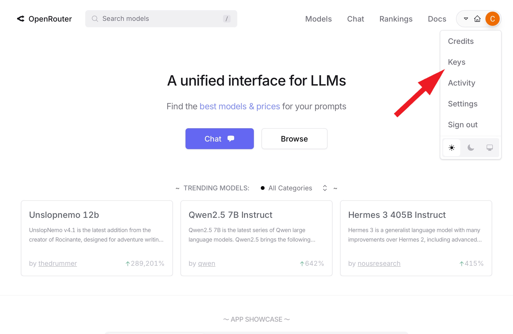
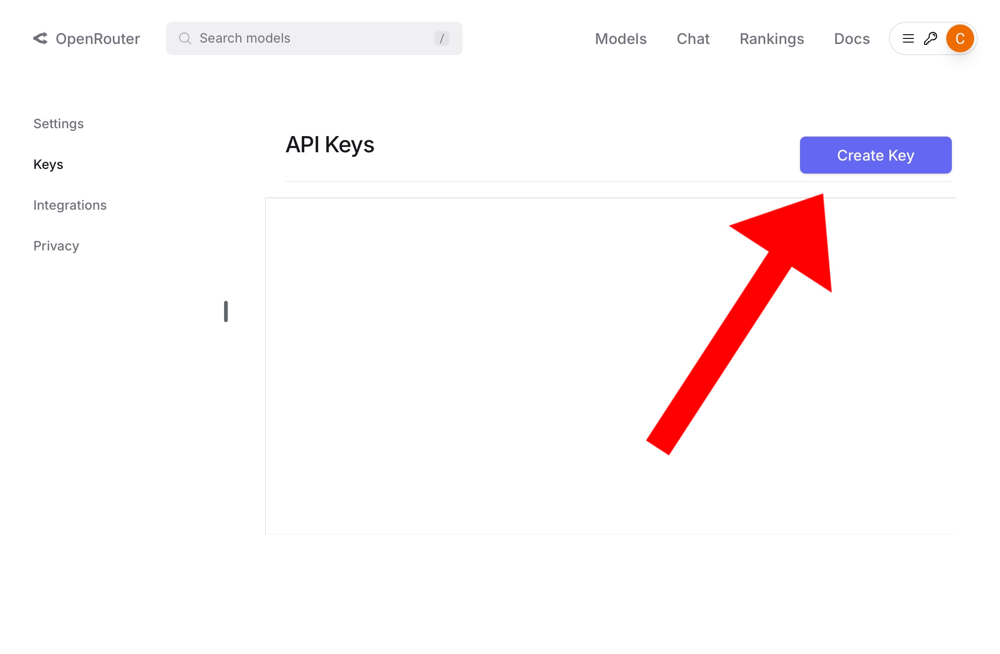

# Preview
This bot works by using the API from openrouter. Nothing much to say, but if you want to browse through any other parts or skip some parts, you can do so by clicking the section button on the top left of this readme!

- [ ] Video :
     Not available yet :sob: :skull:

## Prerequisites

1. Flask
2. Discord
3. Python-dotenv
4. Requests

### Openrouter - API

1. Go to https://openrouter.ai/ and create an account.
2. After that, click on API keys
 
3. Then, create a new one
  
> [!IMPORTANT]
> Copy the token, because this is the only time you can copy it. this is important!

### Discord bot

#### Getting the tokens
1. Go to https://discord.com/developers/applications/ or click [here](https://discord.com/developers/applications/) and create a new application
   
2. After you're inside your bot's page, name it whatever you'd like, then click on "Bots", like in this picture
   
3. Press "Reset Token" and make sure to copy the token to somewhere you can find.
   
> [!IMPORTANT]
> Make sure to copy it somewhere, because this is the only time you can copy it, or else you have to reset the token again!

#### Getting the invite link
1. Go to OAuth2, and follow the steps :
   
   
2. You can then just paste this into any server you want or put it into the browser, and just invite the bot to any server. However, we will not be using it for anything else.

## Installation

### Requirements
- Python V3.9+
- Any code-editing apps
- Discord bot

## Method 1 - Running locally
##### Cloning and editing stuffs
1. Clone this repository by :
   - Github clone :
     `git clone https://github.com/s16899/Matsuri_V2.git`
   - Download Zip
2. Open any code editing software and create a new context in "contexts" folder
> [!TIP]
> name it something that matches the character so you won't get confused!
3. To create context, just create something like "context.txt", where "context" is the name of character, then just put in the context on what the bot should act like.
> eg:
  
4. Then, create a .env file, and put in the following :
  ```py
  DISCORD_TOKEN=PUT_YOUR_DISCORD_TOKEN_HERE
  API_KEY=PUT_YOUR_OPENROUTER_AI_KEY_HERE
  ```
> [!CAUTION]
> Don't forget to change the `PUT_YOUR_DISCORD_TOKEN_HERE` to your discord token you've copied
> And also don't forget to change the `PUT_YOUR_OPENROUTER_AI_KEY_HERE` to the openrouter.ai secret key!
5. Now go to `main.py`, and you should see something like this :
> one `*` = important, 
> three `*` = MUST
  
##### actually running it - locally
1. in the terminal, run :
   `pip install -r requirements.txt`
2. Wait for it to be done
3. To run the bot, run the following command inside the terminal :
   `python main.py`
   OR if python extension is installed, then you can just click the green play button on the top right of the code, and that should do the same thing.
4. Find your bot and open its dms, and it should work.

## Method 2 - Running via github's Codespace system
##### Creating Codespaces
1. Click on Code > Codespace > "+"
   
2. Upon opening the Codespace, make sure you install the "Python" extension. By default, there should be a pop up saying "do you want to install Python?", just click Yes. Else, you have to run the command instead of pushing the Green play button!

##### Cloning and editing stuffs
1. Create a new context in "contexts" folder
> [!TIP]
> name it something that matches the character so you won't get confused!
2. To create context, just create something like "context.txt", where "context" is the name of character, then just put in the context on what the bot should act like.
> eg:
  
3. Then, create a .env file, and put in the following :
  ```py
  DISCORD_TOKEN=PUT_YOUR_DISCORD_TOKEN_HERE
  API_KEY=PUT_YOUR_OPENROUTER_AI_KEY_HERE
  ```
> [!CAUTION]
> Don't forget to change the `PUT_YOUR_DISCORD_TOKEN_HERE` to your discord token you've copied
> And also don't forget to change the `PUT_YOUR_OPENROUTER_AI_KEY_HERE` to the openrouter.ai secret key!
4. Now go to `main.py`, and you should see something like this :
> one `*` = important, 
> three `*` = MUST
  
##### actually running it - locally
1. in the terminal, run :
   `pip install -r requirements.txt`
2. Wait for it to be done
3. To run the bot, run the following command inside the terminal :
   `python main.py`
   OR if python extension is installed, then you can just click the green play button on the top right of the code, and that should do the same thing.
4. Find your bot and open its dms, and it should work.


## Goals and Updates expected

Currently, here are my goals I would like to try for this project : 
- [x] Make a video about it
- [ ] Make a video explaining how to use this github repository
- [ ] Making an update server

What I haven't put inside here yet : 
- [ ] Putting in the tutorial for hosting the bot for 24 hours
